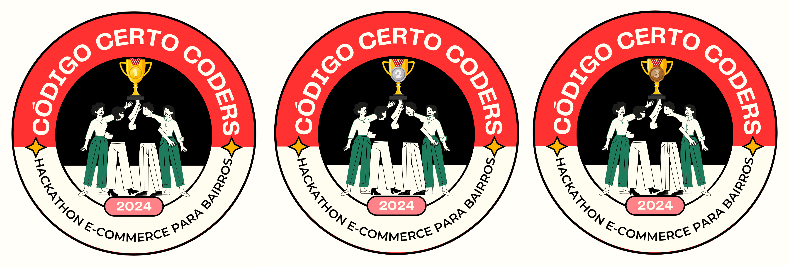
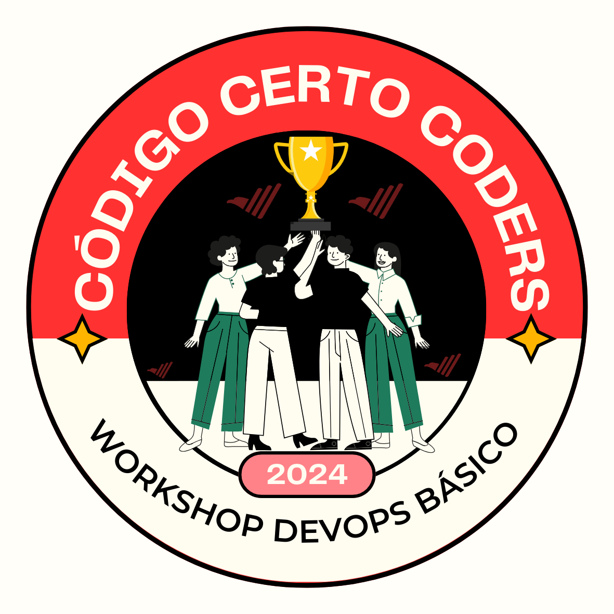
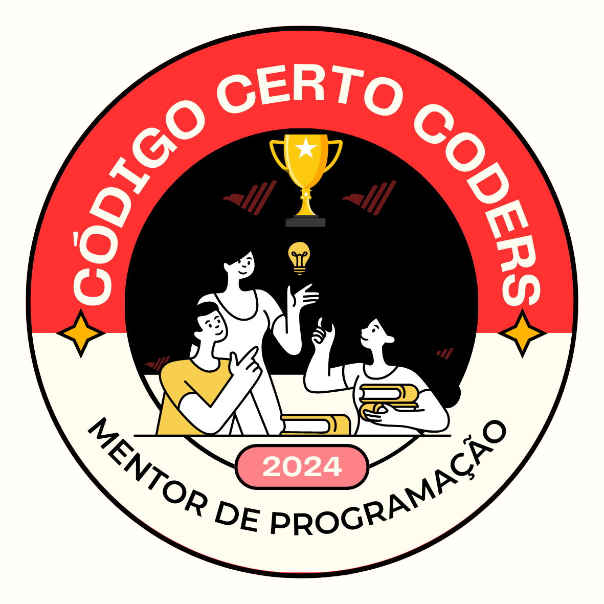

# Badges por Atividades 🎉

Este é o lugar onde você pode encontrar os badges concedidos por participar de atividades na comunidade, como hackathons, workshops, treinamentos e outros eventos. Membros que se destacam em engajamento e colaboração podem receber badges específicos.

## Badges Disponíveis

### 🏅 Participação em Hackathons
- **Hackathon Código Certo Coders 2024**:
  - 

### 🏅 Conclusão de Workshop
- **Workshop DevOps Básico**:
  - 

### 🏅 Mentor de Iniciantes
- **Mentor de Programação**:
  - 

## Como Conquistar

- Participe dos eventos e atividades organizados pela comunidade.
- Mantenha-se ativo e colaborativo no grupo.
- Receba seu badge ao final de cada atividade e compartilhe com orgulho suas conquistas!
