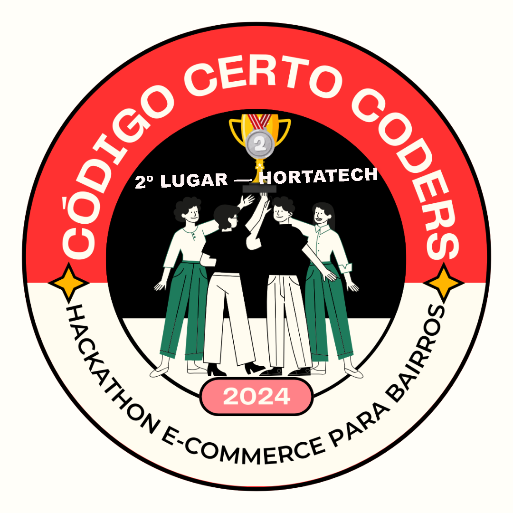
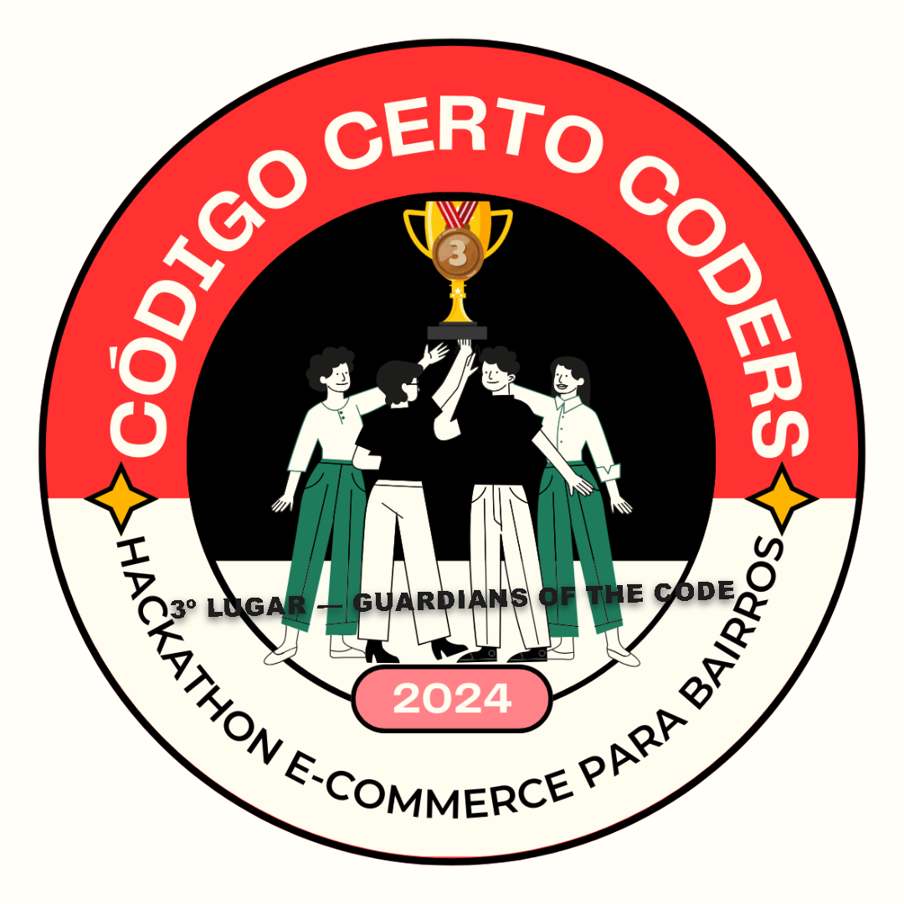

# 🏆 **Badges de Premiação – Hackathon**

Aplicação oficial dos badges concedidos às equipes vencedoras do hackathon, classificados do **1º ao 3º lugar**.

---

## 🥇 **1º Lugar — Greenline (Equipe 17)**

### 🌿 *Solução vencedora com alta inovação e execução impecável*

| Badge | Integrante               | GitHub                                                               |
| ----- | ------------------------ | -------------------------------------------------------------------- |
| 🏅    | **Gustavo Ronan**        | [@gustavoronan](https://github.com/gustavoronan)                     |
| 🏅    | **Lucas Schneider**      | [@lucasSchneider1999](https://github.com/lucasSchneider1999)         |
| 🏅    | **Eduardo Pereira Lima** | [@EduardoPereiraLima-Dev](https://github.com/EduardoPereiraLima-Dev) |

---

## 🥈 **2º Lugar — HortaTech (Equipe 15)**

### 🌱 *Projeto de grande impacto e execução sólida*

| Badge | Integrante            | GitHub                                                 |
| ----- | --------------------- | ------------------------------------------------------ |
| 🥈    | **Pedro Santos**      | [@PedroHaugusto](https://github.com/PedroHaugusto)     |
| 🥈    | **Willian Gonçalves** | [@wilgoncalves](https://github.com/wilgoncalves)       |
| 🥈    | **Andre Silva**       | [@Hardsys-Andre](https://github.com/Hardsys-Andre)     |
| 🥈    | **Vinicius Dyonisio** | [@viniciusdyo](https://github.com/viniciusdyo)         |
| 🥈    | **Eliza Lima**        | [@elizalap](https://github.com/elizalap)               |
| 🥈    | **Yuri Nascimento**   | [@yurinasc21](https://github.com/yurinasc21)           |
| 🥈    | **Viviane Santos**    | [@VivianeSantos35](https://github.com/VivianeSantos35) |

---

## 🥉 **3º Lugar — Guardians of the Code (Equipe 14)**

### 🛡️ *Solução confiável, funcional e bem apresentada*

| Badge | Integrante               | GitHub                                                   |
| ----- | ------------------------ | -------------------------------------------------------- |
| 🥉    | **Julio Cesar**          | [@devjuliof](https://github.com/devjuliof)               |
| 🥉    | **Joalisson Pinto Maia** | [@joalisson-p-maia](https://github.com/joalisson-p-maia) |
| 🥉    | **Dickson Freitas**      | [@dickfreitas](https://github.com/dickfreitas)           |

---

## Seu Badge de Reconhecimento 🥇

Como forma de reconhecimento pela sua contribuição e participação, você foi premiado com o badge especial **"Hackaton E-commerce para Bairro"**! Esse badge foi concedido em homenagem à sua dedicação e ao excelente trabalho realizado. Continue nessa jornada de inovação e aprendizado!

---

## Como Baixar e Compartilhar Seu Badge 🖼️

### Passos para fazer o download

1. Clique no link abaixo para visualizar e baixar o seu badge:
   - [Download Badge 1º- Hackaton E-commerce para Bairro](1-lugar-badge.png)
   - [Download Badge 2º- Hackaton E-commerce para Bairro](2-lugar-badge.png)
   - [Download Badge 3º- Hackaton E-commerce para Bairro](3-lugar-badge.png)

2. Após o download, você pode usar o badge em:
   - Seu **perfil do GitHub**: Adicione o badge ao README do seu perfil ou repositório.
   - Seu **LinkedIn**: Compartilhe o badge em suas postagens ou no seu perfil, exibindo a conquista para seus contatos profissionais.
   - Outras redes sociais: Mostre o reconhecimento da sua conquista para a comunidade e inspire outros a seguirem o mesmo caminho!

### Passo para adicionar ao README do GitHub

1. No repositório onde você quer adicionar o badge, edite o arquivo `README.md`.
2. Inclua o seguinte código markdown para exibir o badge no seu repositório:
   
   
   
3. Salve o arquivo e visualize o seu README com o badge!

---

## Próximos Passos 🚀

Seu potencial é incrível e nós da **Código Certo Coders** estamos ansiosos para ver as próximas soluções inovadoras que você criará! Continue explorando, aprendendo e compartilhando suas ideias com a comunidade. Lembre-se de que cada contribuição faz a diferença e inspira outros a seguirem pelo mesmo caminho de crescimento e evolução.

Se precisar de apoio ou quiser colaborar em novos projetos, estamos aqui para ajudar! Sinta-se à vontade para entrar em contato com outros membros e compartilhar seus próximos passos.

---

**Mais uma vez, parabéns a todos!**  
Continuem a trilhar o caminho do sucesso e inovação. Estamos todos juntos nessa jornada!

---
