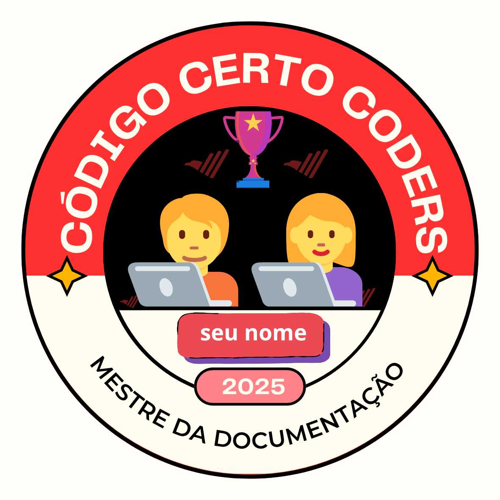

# 🏅 Badge Mestre da Documentação

Arquivo oficial de reconhecimento referente ao desafio **Mestre da Documentação**, concluído por este membro da comunidade **Código Certo Coders**.

---

## 📛 Identificação do Membro
- **Usuário GitHub:** `contribuidor-modelo`
- **Nome:** [Substituir pelo nome do membro]
- **Projeto Documentado:** [Link para o repositório utilizado no desafio]
- **Entrega:** [Data de conclusão]

---

## 🎯 Critérios Atendidos
- [x] README.md criado ou reestruturado seguindo todas as seções obrigatórias.
- [x] Clareza, organização e padronização na escrita técnica.
- [x] Utilização de boas práticas de documentação.
- [x] Entrega dentro do prazo de 48 horas após início do desafio.

---

## 🧾 Avaliação da Equipe
Este membro demonstrou capacidade de:

1. **Escrever documentação técnica clara e objetiva**, facilitando o entendimento de qualquer usuário ou colaborador.  
2. **Organizar conteúdo de forma profissional**, seguindo padrões reconhecidos pelo mercado.  
3. **Cumprir prazos e demonstrar disciplina**, características essenciais para qualquer desenvolvedor.

---

## 🖼️ Badge Recebido

---

## 🎖️ Reconhecimento
O membro `contribuidor-modelo` está oficialmente certificado como **Mestre da Documentação** dentro da comunidade **Código Certo Coders**.

---
✨ _Código Certo Coders – Reconhecendo quem domina a arte de documentar com excelência._
