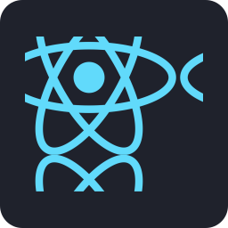
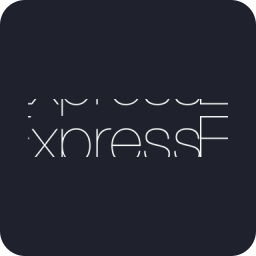

# 🧱 Stack 1 – Simples (React + Node.js + SQLite)

<div align="center">






</div>


## 🎯 Visão Geral
Stack projetada para iniciantes que desejam construir uma versão funcional do **OnComanda** com baixo custo de infraestrutura e configuração mínima. Foco total em entregar algo que funcione rápido, com curva de aprendizado leve.

## 🧩 Tecnologias
- **Frontend:** React + Vite  
- **Backend:** Node.js + Express  
- **Banco de Dados:** SQLite (usando Prisma ORM)  
- **Autenticação:** JWT simples  
- **Comunicação em tempo real:** Socket.io  
- **Hospedagem:** Render, Railway (gratuitos)

## 🚀 Estrutura de Pastas
```

/frontend  → Interface do garçom e monitor da cozinha
/backend   → API REST + WebSocket
/admin     → Dashboard administrativo

````

## 🗄️ Banco de Dados
SQLite é local e leve, perfeito para MVP.  
Comandos básicos:
```bash
npx prisma migrate dev
npx prisma studio
````

## 🔌 Endpoints Principais

* POST /auth/login
* GET /tables
* POST /orders
* PATCH /orders/:id/status
* GET /products

## ⚡ Comunicação em Tempo Real

Atualizações de pedidos via **Socket.io**, emitindo eventos como `order.created` e `order.updated`.

## 🧰 Deploy Simplificado

```bash
npm install
npm run dev
```

Deploy gratuito no Render com build automática.

## 🧠 Ideal Para

Desenvolvedores iniciantes que querem **entregar rápido**, testar o fluxo completo e entender a integração entre frontend, backend e banco local.

````

---
