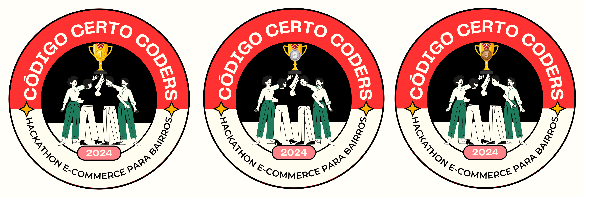
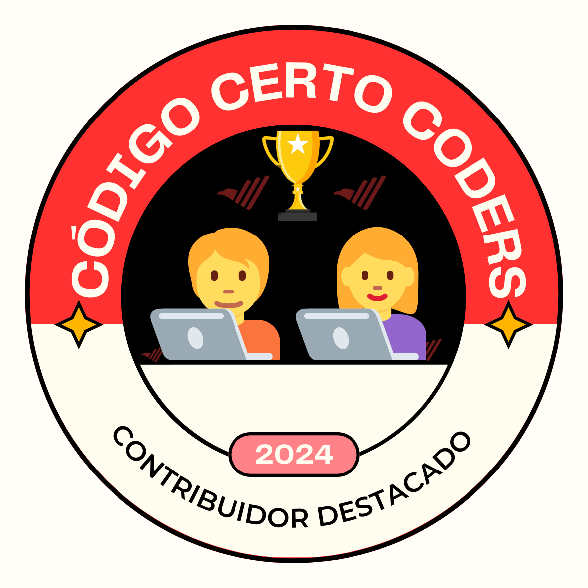

# Badges por Projetos 🛠️

Aqui você encontra os badges concedidos por completar projetos e desenvolver soluções para a comunidade ou para desafios específicos. Esses badges são ideais para destacar o seu trabalho como desenvolvedor ou líder de projeto.

## Badges Disponíveis

### 🏅 Criação de Solução para Pequenos Negócios
- **Projeto "E-commerce de Bairro"**:
  - 

### 🏅 Melhor Projeto de Equipes
- **Projeto "Landing Page da Código Certo Coders"**:
  - 

### 🏅 Contribuição com Código Open Source
- **"Contribuidor Destacado"**:
  - 

## Como Conquistar

- Desenvolva um projeto para um dos desafios ou hackathons da comunidade.
- Contribua com soluções ou melhorias para projetos de código aberto.
- Complete projetos propostos pelos mentores e ganhe seu badge!
